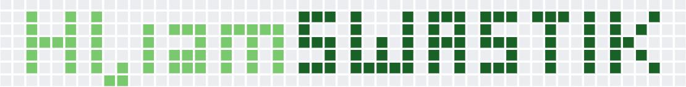

 

## 💫 About Me:

- 👾 Linux Enthuiast
- 🎓 Sophomore at NIT HAMIRPUR
- 🧑🏻‍💻 Open Source Enthuiast
- 🚀 Learning new Web Technologies at TOP PACE

Fun Fact- I changed my branch from Civil to Electrical ⚡

## 💻 Tech Stack:
           

## 🛠️ Tools:
|||||| 
 |---|---|---|---|---| 
 ||||||

## WakaTime Stats:

## 📊 GitHub Analytics:

    
    

## ✍️ Some writings and blogs:

## 🏆 Badges & Rewards:

<kbd></kbd>

## 🌐 Socials:
   
## 🤝 Wanna collaborate on a Project?

