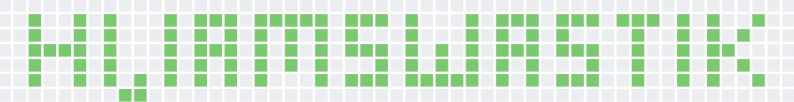

 

## 💫 About Me:
</> Linux Enthusiast >  Electrical Engineer at NIT Hamirpur > Executive Member @ISTE-NITH > Learning New Web Technologies at Top pace. > Open Source is  ❤️ >  Fun fact- I changed my Branch From Civil to Electrical ⚡

## Tools:
|||||| 
 |---|---|---|---|---| 
 ||||||

## 💻 Tech Stack:
              

<!-- ## WakaTime Stats:
 -->

## 📊 GitHub Analytics:

    
    

## 🏆 Badges & Rewards:

<kbd></kbd>

## 🌐 Socials:
   
